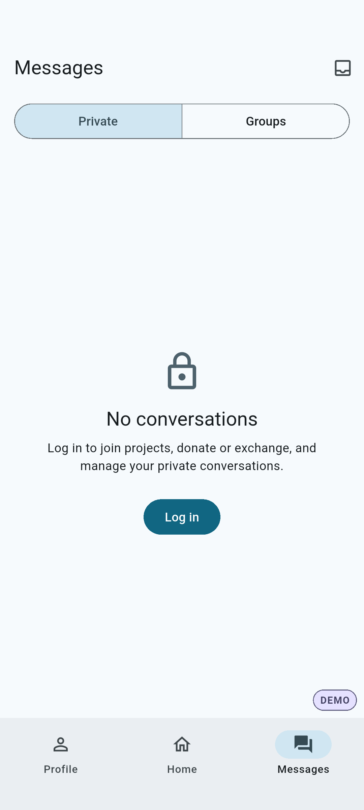
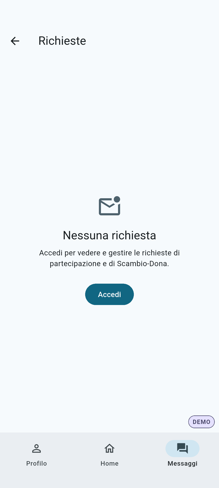
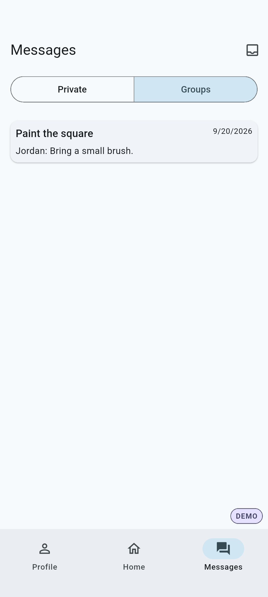
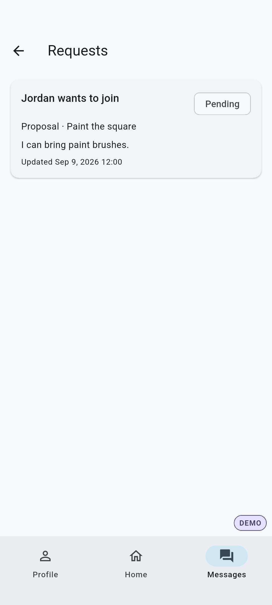

# MSG04 Messages inbox toolbar

Implemented from `PLANETS_MSG04_messages_inbox_toolbar.md`, based on
`1d9871bd64197226089b8477a6fac2ae94431504`.

Chats is the public Messages root, with an accessible 48dp inbox action.
Requests is an in-place secondary destination; toolbar/system Back returns to
Chats. Nested request/chat Back, identity-bound readers, actions and unread
semantics retain their existing owners. Destination and scope survive Auth and
profile completion. The existing tour anchor follows the replacement control;
TUT04 owns the subsequent pacing/copy/animation changes.

Validation on Windows, Flutter 3.47.2:

- Changed Dart formatting and `git diff --check`: passed.
- `flutter analyze --no-pub`: no issues.
- Focused Messages guest/ready, Project chat, router, shell and interactive
  tutorial suites: **186 passed**. Includes EN/IT at 390px/1.3x and 320px/2x,
  semantic tooltip, 48dp target, keyboard activation, pushed/direct/bottom
  navigation, system/child Back, OTP and profile completion, sign-out/account
  replacement and no private providers in guest/ready tour previews.
- Debug APK and `messages_toolbar_smoke_test.dart` on isolated Android API 35
  Pixel 6 emulator: all four guest/ready × EN/IT scenarios passed. The 12 PNGs
  capture actual Flutter Android rendering with deterministic fake gateways,
  not a hosted backend. Representative captures were visually inspected.
- No physical Android device was connected. iOS, physical accessibility and
  hosted-service QA were not performed. No database was reset.

Reproduce native evidence from `apps/mobile` with a dedicated QA emulator:

```powershell
flutter build apk --debug --no-pub --target=integration_test/messages_toolbar_smoke_test.dart
flutter drive --no-pub -d emulator-5584 --use-application-binary=build/app/outputs/flutter-apk/app-debug.apk --driver=test_driver/tutorial_screenshots.dart --target=integration_test/messages_toolbar_smoke_test.dart
```





