# TUT04 tutorial pacing, preload and finale

Implemented from `PLANETS_TUT04_tutorial_pacing_prefetch_transitions_finale.md`.
The isolated branch started on MSG04, then integrated main's MAP05 discovery
change (`dfc56979f420663630069a985dcc385b88dca4a4`) and MSG04's updated
`2c517cb05dfc616d88badcba5869a00b9b2f6ebd` before final validation.

New pages remain unobscured for 600ms after meaningful content renders, followed
by a 380ms scrim/outline fade. Same-page targets use a shorter fade. Previous,
Next and Skip remain interruptible after the 250ms surface-commit debounce.
Reduced motion uses the settled composition. The footer has equal 56dp controls
and explanation text is 19sp, with a bounded scrollable pane at large text sizes.

The tour starts the existing public Project read early, warms at most the first
three canonical summary covers through the existing authorized cache, and
coalesces only the selected first detail by ID/session. Normal detail reads and
browse filters/paging retain their contracts. Real participation scroll duration
comes from measured distance, capped at 500 logical pixels per second.
Drafts/inbox holes follow the actual Icon bounds with 3px padding; Scambio keeps
three disjoint holes. The farewell alone ascends from 50% to 44% of its canvas
while seeded stars keep moving down. Home and Welcome retain their motion.
Guest Messages previews also use the selected Chats scope's access copy.

## Validation and provenance

- Flutter 3.47.2 / Dart 3.13.2 on Windows.
- Formatting: 583 source/test files checked, zero changes; `git diff --check` passed.
- `flutter analyze --no-pub`: no issues.
- Final focused interactive tutorial, shared hero and guest Messages suites:
  **63 passed**.
  Cover new-page hold/fade, coalesced public preloads, session replacement,
  canonical cover order, short/long scroll velocity and cancellation, icon bounds
  after rotation/reflow, EN/IT at 320px/2x, reduced motion, replay/storage,
  lifecycle interruption and farewell-only geometry/star travel.
- Final-head Mobile CI is required before merge; the PR check is the durable full
  mobile-suite result. Backend, web and site are outside this mobile-only change.
- Android visual run uses a dedicated Pixel 6 API 35 x86_64 emulator (5584).
  All three journeys passed (plus harness teardown), producing 28 PNGs. The
  required page/fade, icon, short/long detail and finale captures were inspected.
  Real production Flutter widgets use deterministic fake gateways and the
  existing licensed bundled cover. No hosted backend or database reset is used.
- Native APK source before evidence/dependency rebase:
  `d9808d2c9ca8a07d98f06b5ccfc4610594c8bb1d`.
  SHA-256: `3CF5A04A600165498E015910D7E1054E8FD8B1CD5E0279937566F82009535A66`.
- QA used only the isolated Android emulator. Physical Android, iOS,
  physical-device accessibility and hosted-service QA were not performed.

Reproduce from `apps/mobile` on an isolated emulator:

```powershell
flutter build apk --debug --no-pub --target=integration_test/tutorial_smoke_test.dart --dart-define=TUT04_SCREENSHOTS=true
flutter drive --no-pub -d emulator-5584 --use-application-binary=build/app/outputs/flutter-apk/app-debug.apk --driver=test_driver/tutorial_screenshots.dart --target=integration_test/tutorial_smoke_test.dart --dart-define=TUT04_SCREENSHOTS=true
```

The screenshot helper explicitly pumps pending layout/paint and waits for Android
image acquisition. Mid-fade frames already have a painted intermediate alpha;
those wait for acquisition without another animation tick and assert that the
alpha remains intermediate. Scroll captures wait for actual movement to begin.
The live test binding can show a colored pointer marker from
the preceding test tap; it is test instrumentation rather than product UI.
Captures include normal English and a 320x720 logical Italian viewport at 1.3x
text. Widget tests additionally cover 2x text and both themes.

## Android captures

The image pairs show the new page without a mask and the following mid-fade;
the focus images show the final holes. The Project examples are real production
detail widgets populated through the test gateways, including a first Full
Project and a 32-paragraph description. The Italian screenshots also exercise
three preloaded covers and narrow icon placement.

| New page before mask | Mid-fade |
| --- | --- |
| 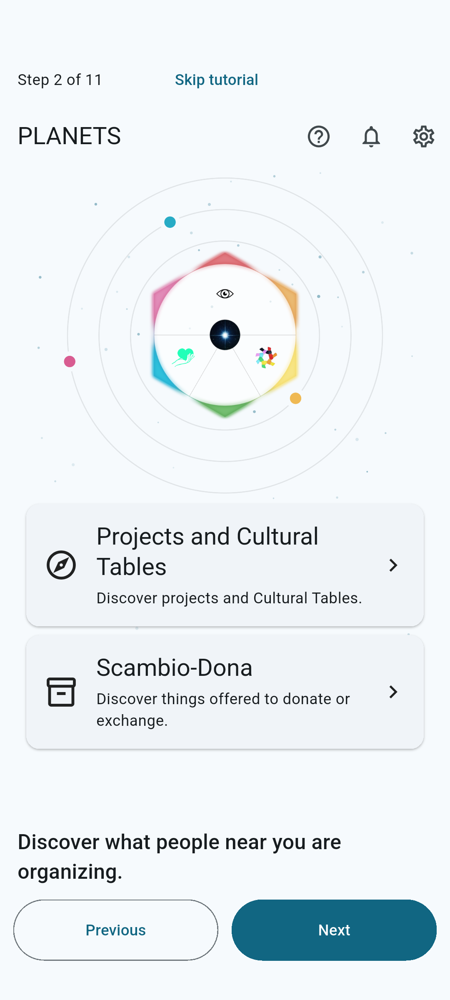 | 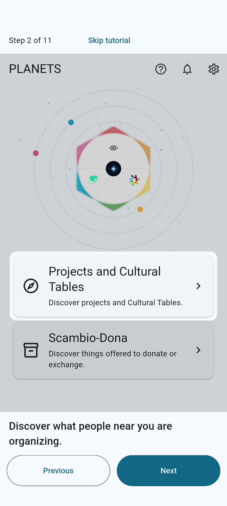 |
| 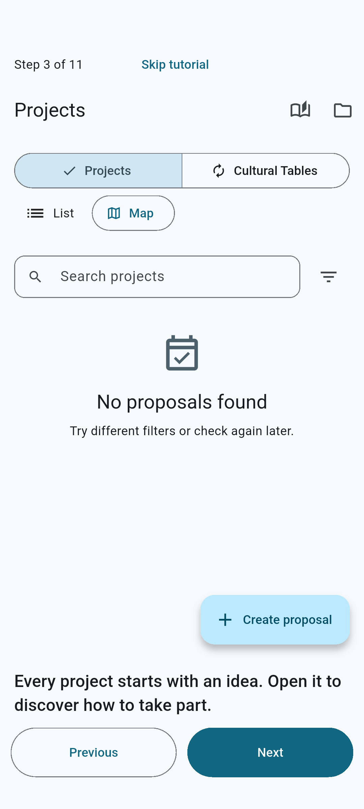 | 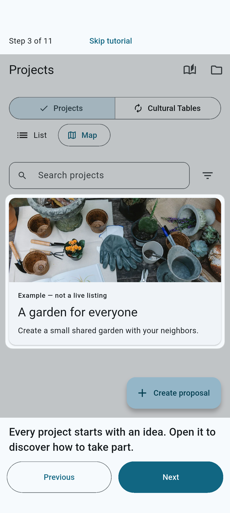 |
| 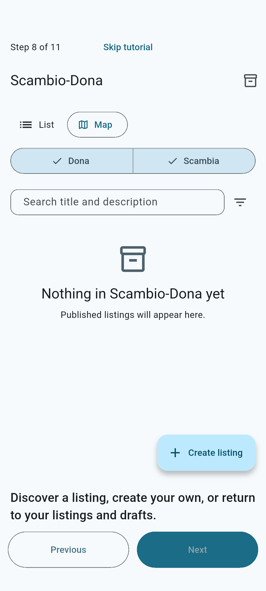 | 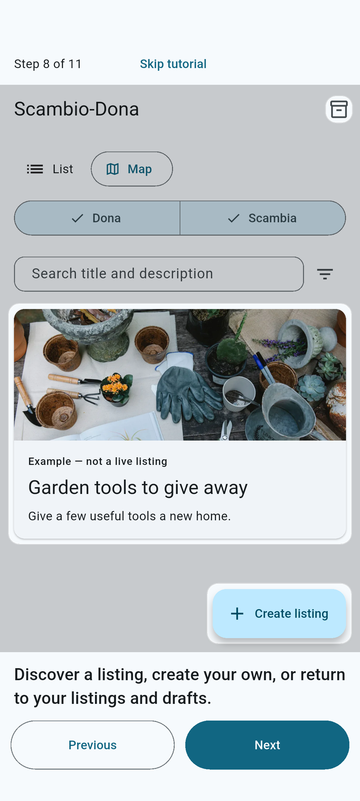 |
| 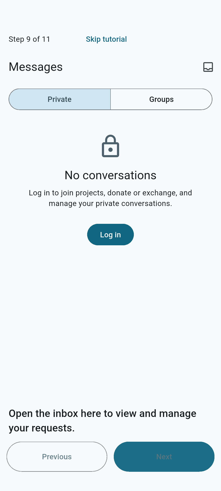 | 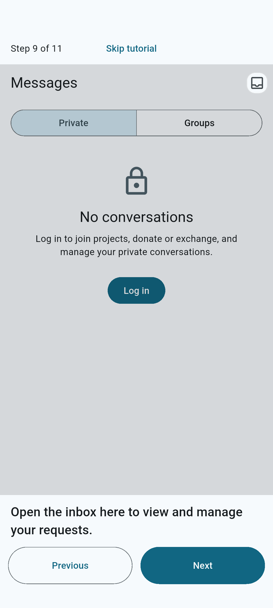 |

| Final Drafts hole | Three Scambio holes | Messages inbox |
| --- | --- | --- |
| 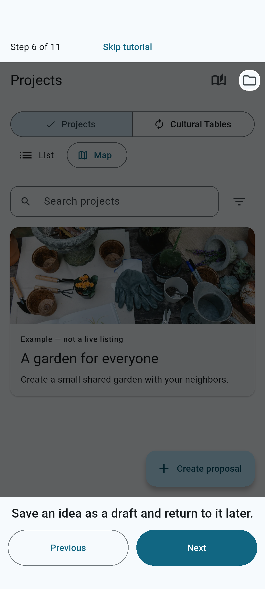 | 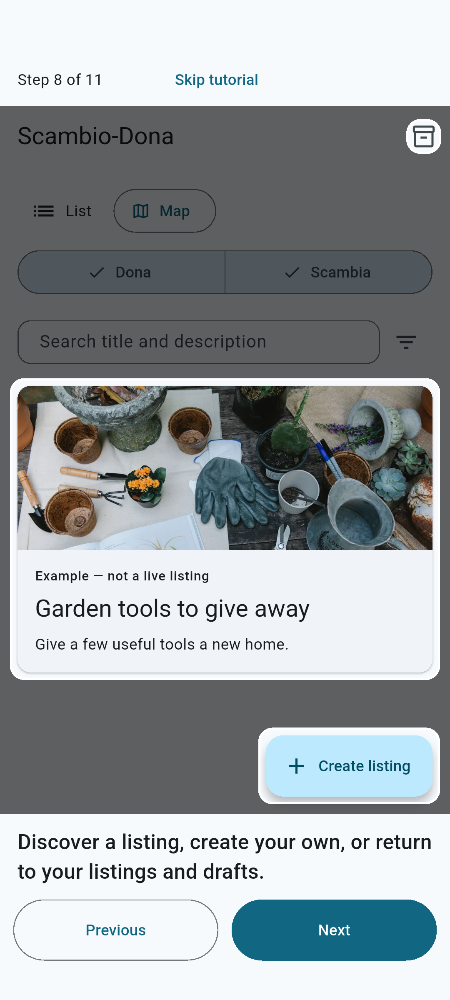 | 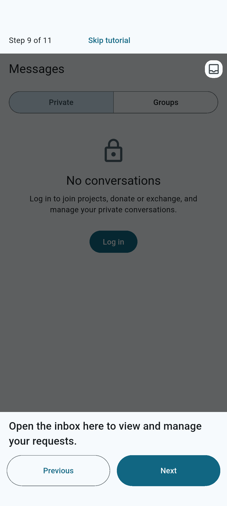 |

| Short detail start | Short detail during scroll | Full participation |
| --- | --- | --- |
| 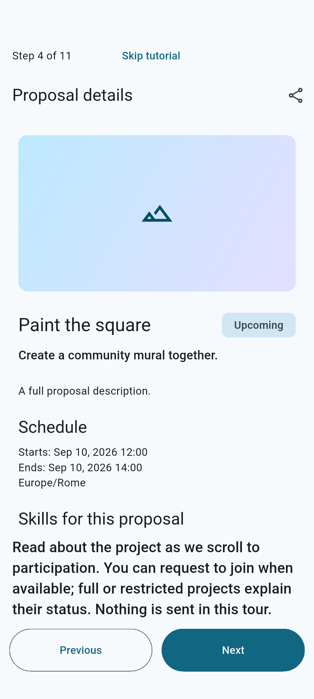 | 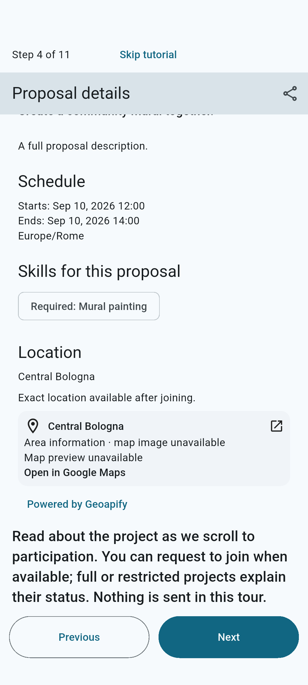 | 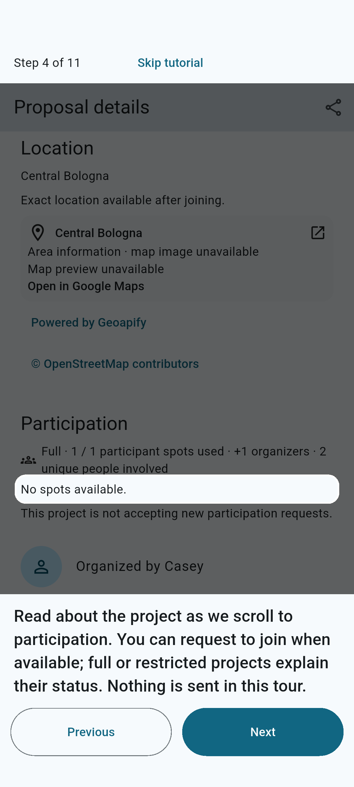 |

| Long detail start | Long detail during scroll | Long participation |
| --- | --- | --- |
| 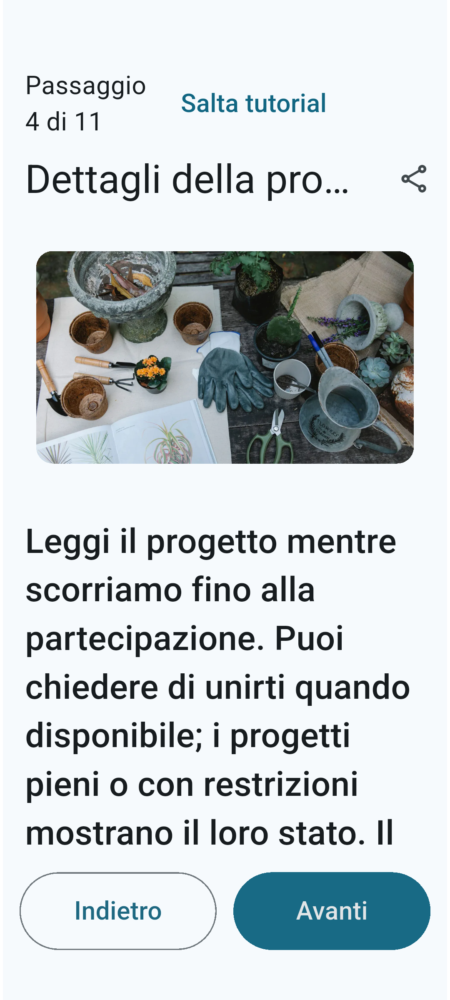 | 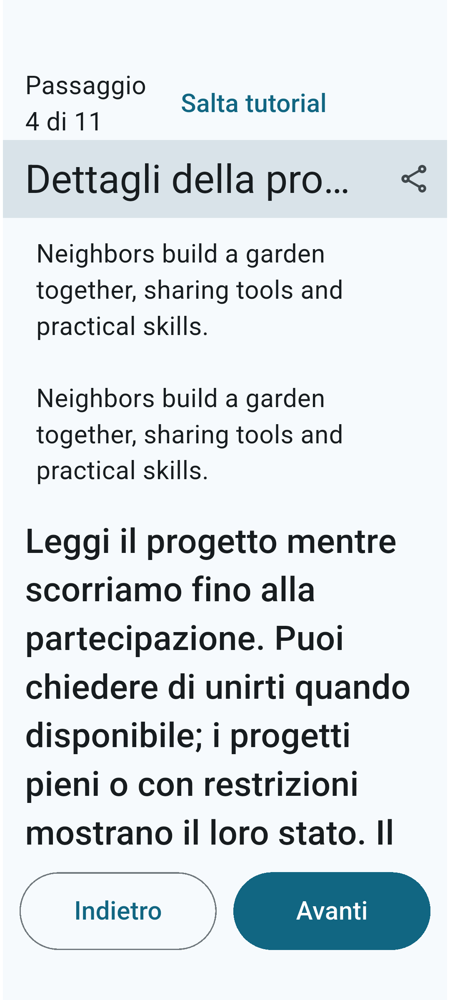 |  |

| Italian preloaded Projects | Narrow Drafts | Narrow inbox |
| --- | --- | --- |
|  | 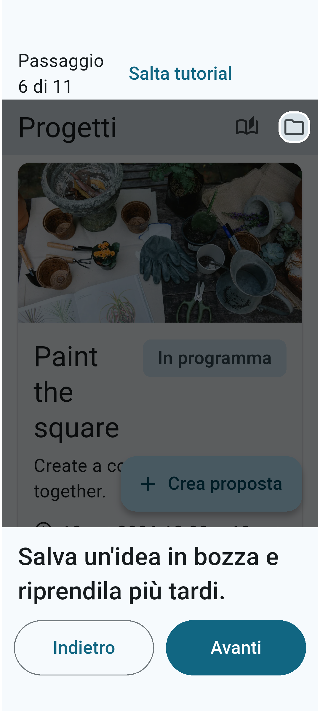 |  |

| Farewell entrance | Settled composition | Stars continue later |
| --- | --- | --- |
| 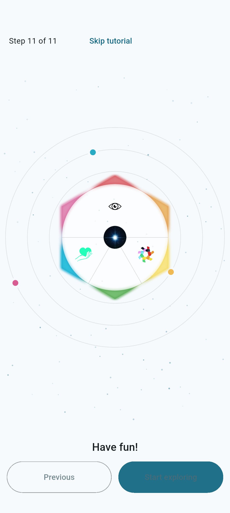 | 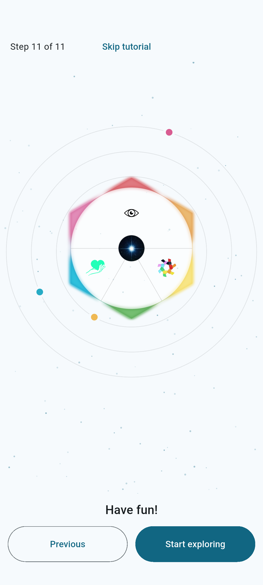 | 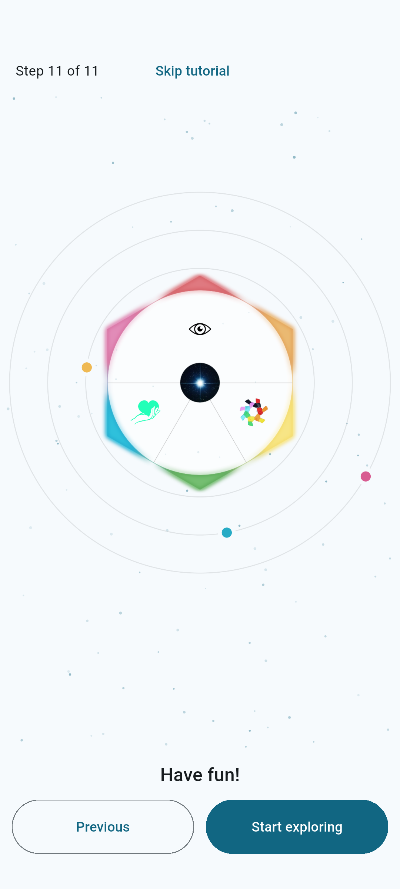 |
