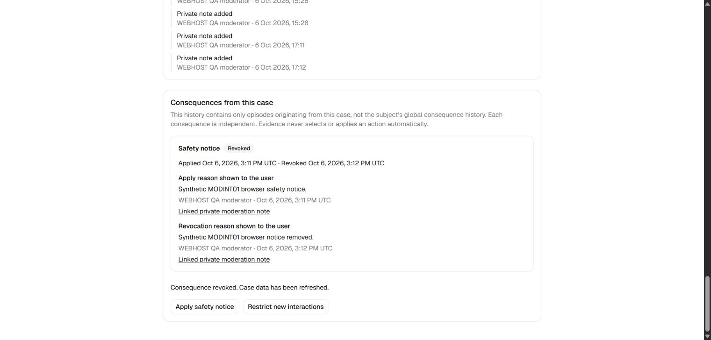

# MODINT01 moderation/Auth integration review

Status: **draft integration; required live QA incomplete; not merged or deployed**. Founder
moderation copy/presentation and unresolved policy review remain mandatory.
No predecessor PR is closed, retargeted, marked ready, or merged by this task.

## Exact inputs and provenance

### October 8 committed-main reconciliation (validation in progress)

After the founder started only the owned backend, its health check passed.
Fetched committed main advanced to `e7971d6611a1bd750c0c51b797234f5cf19c9dec`
(merged #156–#167). The previous published head
`cf85c6895cf0351429e1c8a2b91d13569b5afcae` conflicted with that main; this
continuation merges it into the same branch/PR without rewriting either history.
All thirteen conflict files retain both histories' behavior and localization keys.

Auth retains main's explicit restoration failure/retry, Welcome/logout behavior
and warm same-actor navigation. A warm token refresh still performs the fresh
canonical suspension check; denial/failure closes private views without another
profile-readiness read. Full bootstrap and OTP replacement/ABA epochs remain.
Welcome owns only unresolved signed-out restoration, never a suspension bypass.
Focused unit/widget coverage includes warm suspension/error, late actor results,
Welcome/tutorial/drafts escape prevention and private-link restoration retry.

Main removed Home's Auth card. The convergence tests now use ordinary Welcome
login, assert canonical ready/incomplete state plus the actual Home hero, and
verify genuine sign-out errors at the current Settings action. Native harnesses
use Welcome or public Messages login and Messages' profile setup action; normal
OTP, canonical gateways, guards and assertions remain. No session is injected.
The first full Mobile run's two obsolete Home-entry test failures are retained
in the private log; their corrected focused replay passed. The final full run
and new combined Database/Web/Site gates are not yet claimed here.

The new v4 conversation-list API enters the reviewed suspension inventory and
real-auth pre-existing-session/expected-ID denial matrix. New template timezone
defaults and push-projector receipt recheck preserve their canonical account and
worker boundaries. Required fresh database and Android validation is pending.
October 6–7 browser/native/CI evidence below is historical, not proof of this
October 8 merge. The previously compiled APKs/configs must not be replayed as
current-source evidence: prepare fresh actors after database gates and rebuild.
Draft, founder review, no merge/deploy and dependency/Realtime limitations remain.

### Historical committed-main continuation (2026-10-06–07, native replay blocked)

The continuation prompt supersedes the original #146/#153 exclusion below.
Fetched main was pinned once at `9cd024cc38c02b0333a32f8abe71fdc9681df548`,
including merged #146, #153 and #155 unread/activity separation. The same branch
and draft PR are retained. Merge `ebf71346a1fde1ed6ec5bf7648115f5e253a19d7`
has parents `5f85b39ecf27fdbf9aa24bf91ce554d6becf4857` and that main pin.
All 15 text conflicts are reconciled; both histories' tests and contracts remain.
Generated types are replay-generated, not an unverified conflict union.

The retained editor and router departure guard preserve ordinary same-account
checks but clear authority on suspension/status failure. Three new regression
tests pass. Template-removal errors recognize canonical PT403; the combined staff
detail loads both consequence history and template review. Test fixtures now
explicitly supply both reads rather than treating an added read as unexpected.

The combined inventory is 231 signatures (205 deny suspended, 22 public, one
safe own-status, three worker-only). The original 210 count below is historical.
New broadcasters bypassed recipient filtering; forward migration `20261006184900`
retains their payloads/endpoints and composes the existing suspension boundary.
Replay and 127 SQL files / 3,880 assertions pass. Real pre-existing JWTs pass 18
additional private RPC denials/expected-ID mismatches and addressed-row delivery
filter/revocation checks; those are not cached-socket observation or browser UI.
The first combined runtime attempt failed because its pending producer belonged
to the later blocked delegate's Project; the canonical withdrawal was correct.
A separate synthetic no-delegate Project supplies the unaffected real producer.
No history was repaired or assertion weakened. Failed logs are retained privately.

Browser control recovered and the normal-browser campaign completed on the
combined runtime. The exact EN/IT copy extract was regenerated and verified
against the current ARBs (46 keys; no wording rewrite). Founder approval remains
pending. All evidence below uses synthetic, task-owned data.

#### Combined-source validation

| Area                            | Actual continuation evidence                                                                                                                                                                                                                                                                                          |
| ------------------------------- | --------------------------------------------------------------------------------------------------------------------------------------------------------------------------------------------------------------------------------------------------------------------------------------------------------------------- |
| Mobile                          | Full l10n/format/analysis gate; 1,610 passing tests, two pre-existing skips. Final native harness formatting/analysis also passes.                                                                                                                                                                                    |
| Web/tooling                     | 57 tooling tests and 455 Web tests pass / one pre-existing Web skip; lint, types and production Next 16.3.8 build pass. Launcher lint/types pass.                                                                                                                                                                     |
| Site                            | 34 client tests and 19 worker tests; lint/types/build and Cloudflare deployment dry run pass. No deployment.                                                                                                                                                                                                          |
| Database                        | Full `npm run check:db`: replay, lint/advisors, 127 pgTAP files / 3,880 assertions, generated-type drift, domain/media/chat/notification/demo verifiers, complete 231-signature suspension audit and real-auth/concurrency gates pass.                                                                                |
| Concurrency                     | Suspension: 24 observed-lock winner-order races. MODINT: six observed-lock apply/admission races and two revoke/recovery races pass. Producer-before-global-worker ordering retained.                                                                                                                                 |
| Web Auth / Tavoli               | Configured owned Mailpit 54614 real-auth checks pass. The first omitted-Mailpit command failed and is retained separately.                                                                                                                                                                                            |
| Hosting HTTP/SSR                | Fresh 35-case campaign passes anonymous and authenticated contracts: chunked refresh, interleaved HTML/Flight/private cache isolation, notes/evidence denial, forged moderator/self suspension denial, stale/suspended staff reauthorization and independent sign-out. This is not provider/CDN/free-tier validation. |
| Android compilation / native UI | Matching APKs compile. Final complete native results are recorded below; compilation alone is not a flow pass.                                                                                                                                                                                                        |

The full gates used combined production trees at `94fac4b` / `b928e77`;
later native changes are fixture/test synchronization only. Runtime-source
equivalence and the final hosted source are recorded separately in PR evidence,
not silently inferred from an old run.

#### Actual normal-browser campaign

- Normal moderator OTP, safety-notice apply/revoke through actual controls, distinct
  affected-user reason/private note, persisted Active/Revoked history, and no
  suspension affordance pass.
- Normal admin OTP, suspension apply and canonical unsuspend through actual
  controls pass. Suspended ordinary OTP is valid but Web's canonical setup is
  denied: it shows Finish session setup / Sign-in needs attention, supports
  sign-out, and does not grant a private staff route. No Mobile-specific Web
  suspension screen is claimed. After revocation, ordinary setup converges
  to ready Home; its staff case remains Page unavailable.
- A fresh photo-free participant uses invitation → normal OTP → first-time
  basic profile save → Join Project → token-free confirmation. Explicit Refresh
  participation and the public browser fallback pass. Canonical readback proves
  exactly one membership, one admission receipt, zero photos and a truthful
  invitation origin (null request origin).
- The Open PLANETS link contains only the public Project ID. Store-download
  URLs remain unconfigured and the UI says downloads are unavailable. The local
  public fallback was clicked; installed-app/OS association or actual store
  downloads were not tested.
- Staff hides the Project through actual controls. After sign-out, the bearer
  preview is generic; the rendered DOM contains neither its hidden title nor ID.
  Unknown, revoked and elapsed-Project links have no Join button. There is no
  invitation TTL in this domain: “expired” here means the existing one-time
  Project end-time boundary, not a new expiry feature. Only that named disposable
  fixture's times were temporarily shifted then restored; hide/invitation
  revocation uses real-OTP canonical RPCs. Membership and receipt history remain.

#### Native attempts and disposition

The owned API 35 AVD booted in 36.9 seconds with authorized ADB transport and a
working VM-service connection. Its 1536 MB guest / two cores and precompiled APKs
avoid heavyweight local suites during smoke. Shared devices/ADB were untouched.

Five controlled failed attempts are retained privately. The first passed
real OTP/Home, navigation, photo-free admission, hidden-preview/chat continuity
and EN/IT active/removed notices, then waited for an unbuilt lower Settings exit.
The harness now scrolls the real lazy list to the canonical sign-out action.
The second also passed personal pair send/feed and private template copy, then
a native route/IME animation intercepted its Verify tap. The helper now settles
the route and ensures the real control is visible before tapping. The third
passed A→B OTP and isolated history, then tried to find Sign in on the signed-out
example Profile. The fourth bounded mounted-control wait confirmed this was
the wrong destination, not a transient delay. The harness now navigates to
Home's normal sign-in entry; production Profile/Settings exits do not promise
an automatic Auth redirect. Both helpers settle native OTP route/IME transitions.
The next run passed fresh missing→incomplete→complete profile setup and explicit
admission recovery, then confirmed the same wrong-entry assumption at C's
Settings exit. Every subsequent account entry now uses Home except the deliberate
protected-notices continuation. APK builds numbered 5 were superseded by the
additional suspension-exit/recovery coverage; they were not failed device runs.
No Auth injection, timeout increase, discarded history or softened assertion
was used. Every admission-bearing replay prepares fresh actors/Projects and
rebuilds its matching APK. Earlier partial screenshots are backed up separately
and are not represented as complete smoke results.

Final complete native replay: **blocked, not passed**. On October 7 the user
opened Docker Desktop; the owned API health endpoint returned 200. A fresh
fixture preparation (`otp-defines-8.json`) succeeded. Only the MODINT01 backend
was paused with normal backups retained while compiling. The matching corrected
`c4f5c6ad7bc10d946dfad0a108f63574f5a48f47` APK compiled in 126.7 seconds using a
command-local 1 GB Gradle heap cap. Its SHA-256 is
`316829ba2015bede3436b8561deb7f61b1ac86c86eba41e7931819541a2f3577`.
This fresh fixture/APK has **not** been driven and has not committed admission.
The previous build numbered 7 was interrupted before an APK/result existed;
the first October 7 resume failed before preparation/build while Docker was closed.
Those incomplete/failed logs remain separate from the successful build numbered 8.

The execution tool then rejected the owned backend restart and build-daemon
cleanup commands as blocked by policy. Neither command executed, and no alternate
process kill, shared-service restart or policy bypass was attempted. The emulator
was not booted on October 7. Host memory recovered later (8.2 GB available,
51% commit in the final sample); memory pressure is therefore **not** claimed as
the cause of this last block. The remaining required Android work is explicit:

| Required flow                                                | Current evidence / remaining action                                                                                                                                                                                                                                                                               |
| ------------------------------------------------------------ | ----------------------------------------------------------------------------------------------------------------------------------------------------------------------------------------------------------------------------------------------------------------------------------------------------------------- |
| Normal OTP/Home, navigation and account exits                | Partial native runs pass A→B isolation and C's real missing→incomplete→complete profile setup. Run the full corrected OTP target on fresh fixture 8.                                                                                                                                                              |
| Photo-free invitation and combined-main pair/template sanity | Partial run 6 passes fresh admission, read-only recovery without a duplicate membership, hidden-preview/chat continuity, canonical pair send/feed and private template copy. Complete the corrected target's later access transitions. Delegate denial is independently verified by preparation and domain gates. |
| Private notice types EN/IT                                   | Real active/removed safety, interaction-restriction and content-hide screenshots exist from partial run 6. They do not prove a full suite pass.                                                                                                                                                                   |
| Suspension during ordinary access                            | Full corrected sequence, Back/shortcut/deep-link denial, suspension-screen sign-out, fresh suspended OTP and post-revoke refresh still need execution. EN/IT suspension and removed-suspension captures are missing.                                                                                              |
| Project and Resource request forms                           | The matching compiled request target/config has never been driven. Run both canonical denials, independent own status, notices/Back with retained draft/modal, revoke and deliberate retry, block/account isolation and both PT403 routes. All four EN/IT explanation captures are missing.                       |
| Physical/OS/accessibility checks                             | Physical Android/iOS, TalkBack/VoiceOver, hardware keyboard and public HTTPS association/store downloads remain unrun, not emulator or browser results.                                                                                                                                                           |

The [continuation screenshot index](screenshots/modint01-continuation/README.md)
records source/run provenance and safe representative framing. Seven browser
captures and 16 partial native captures are published. Three staff captures were
withheld in the private backup because their framing included private-note text,
even though synthetic. Actual browser control results remain recorded above;
those withheld images are not public evidence. The partial personal-pair image
shows a live-updates-unavailable banner: canonical send/feed passed, but healthy
socket delivery and the historical Realtime cause are **not** asserted resolved.

#### Hosted source and reproducible rehearsal

Hosted [run 37519603639](https://github.com/lillo24/planets.community/actions/runs/37519603639)
passes Mobile, Web, Site and Database on branch head `b928e77f02e74109a2fd7ceaeb5ded54c5ff942c`.
Actual PR checkout is `17ce5b4609dbf4d298bf1f6a6afeac9f3de0b4b6`, merging
that head into the included main pin. Classification selects all four areas
(253 changed paths), and each job runs successfully. The checkout's relevant
trees are identical to the branch source. Later native test corrections have
their own green hosted result:
[run 37525346794](https://github.com/lillo24/planets.community/actions/runs/37525346794)
on `c4f5c6ad7bc10d946dfad0a108f63574f5a48f47`. Actual checkout in classification
and every area is `935d7e90d81a539d36e3cd5ee9e76f333841f958`, that source merged
into `9cd024cc38c02b0333a32f8abe71fdc9681df548`. All four areas are classified
true (253 paths), run and pass; no required area is skipped. Fetched checkout
and relevant-tree equivalence are verified, not inferred from run metadata.
Main remains the same pin and #154 is cleanly mergeable but deliberately
draft/unmerged. No CI waiver is invoked. The continuation publication changes
only documentation/screenshots; its exact SHA and relevant-tree equivalence to
tested source `c4f5c6a` are recorded in the PR evidence comment. No unrun
publication-head hosted CI result is claimed. A documentation-only `[skip ci]`
commit avoids repeating the same full integration campaign while this PR remains
draft; it does not waive any future ready/merge requirement.

After cleanup, restart from this worktree with the retained canonical backup;
never run a preparer against the restored shared-project config:

```powershell
Set-Location C:/Users/leona/Documents/GitHub/planets-modint01
$qaBackup = 'C:/Users/leona/AppData/Local/Temp/planets-modint01-backup-15b02459aa944e078ca7164a00d61a3f/continuation-4a8d143592974b4385e5e770279f2990'
$qaNode = 'C:/Users/leona/AppData/Local/Temp/planets-authqa01-runtime-ee9648e26eb64e35b6e65049a08a4dbe/node-v24.21.0-win-x64'
$env:PATH = "$qaNode;C:/Users/leona/Documents/GitHub/planets-modint01/node_modules/.bin;C:/src/flutter/bin;" + $env:PATH
./scripts/prepare-local-modint01-qa.ps1 -Action Prepare -BackupDirectory $qaBackup
npm run db:start -- --exclude studio,postgres-meta,edge-runtime,logflare,vector > "$qaBackup/rehearsal-start.log" 2>&1
$env:MAILPIT_URL = 'http://127.0.0.1:54614'
```

The start command resumes retained task volumes, not a reset. Confirm the
owned API 54611 / DB 54612 before fixtures. New full database gates reset the
disposable world, so complete them before preparing UI actors. For native
rehearsal use the [harness map](../../apps/mobile/integration_test/README.md),
each fresh `--modint01` preparer and matching compile-time config/APK:

```powershell
node apps/mobile/integration_test/prepare_authqa_fixtures.mjs --modint01
Push-Location apps/mobile
$env:AUTHQA_SCREENSHOT_DIR = 'C:/Users/leona/Documents/GitHub/planets-modint01/docs/development/screenshots/modint01-continuation/native'
$qaPreviousGradleOpts = $env:GRADLE_OPTS
try {
  $env:GRADLE_OPTS = '-Dorg.gradle.jvmargs=-Xmx1g'
  flutter build apk --debug --target=integration_test/otp_home_test.dart --dart-define-from-file=config/local.json
} finally {
  $env:GRADLE_OPTS = $qaPreviousGradleOpts
}
# Copy this APK outside build/ before compiling any other target.
flutter drive --driver=test_driver/otp_home_driver.dart --target=integration_test/otp_home_test.dart -d emulator-5560 --dart-define-from-file=config/local.json --use-application-binary=build/app/outputs/flutter-apk/app-debug.apk
Pop-Location
node apps/mobile/integration_test/prepare_request_restriction_fixtures.mjs --modint01
# Repeat with request_restriction_test.dart / request_restriction_driver.dart
# and REQUEST_SCREENSHOT_DIR. Never reuse OTP target's APK/config for this target.
```

The unused October 7 APK pair below is retained historical provenance only.
It cannot validate October 8's newer main; use fresh preparation/build above.
These historical commands are not the current-source handoff:

```powershell
Push-Location apps/mobile
$env:AUTHQA_SCREENSHOT_DIR = 'C:/Users/leona/Documents/GitHub/planets-modint01/docs/development/screenshots/modint01-continuation/native'
flutter drive --driver=test_driver/otp_home_driver.dart --target=integration_test/otp_home_test.dart -d emulator-5560 --dart-define-from-file="$qaBackup/otp-defines-8.json" --use-application-binary="$qaBackup/otp-smoke-8.apk"
$env:REQUEST_SCREENSHOT_DIR = $env:AUTHQA_SCREENSHOT_DIR
flutter drive --driver=test_driver/request_restriction_driver.dart --target=integration_test/request_restriction_test.dart -d emulator-5560 --dart-define-from-file="$qaBackup/request-defines.json" --use-application-binary="$qaBackup/request-smoke-5.apk"
Pop-Location
```

Request APK 5 was compiled at `b51098e6489a531a595d0c6274c3432c29d3c1c3`;
its request harness/driver and production Mobile trees are byte-identical at
`c4f5c6a` (verified with Git). Its unused fixture is still retained. If a Project's
ordinary time boundary has elapsed, the world was reset, or a run commits
admission/request changes, prepare fresh matching fixtures and compile again;
never erase history or reuse a completed admission as a new one. Build before
booting the emulator, optionally pausing only this owned backend with backups.
Use the documented command-local heap cap and restore its previous value.

Before the drive, register only the retained owned AVD if its `.ini` is absent
(retain/inspect an existing conflicting registration); its backup is the parent
directory's `restored-checkout-generated/PLANETS_MODINT01_API35.ini`. Use
`Start-Process -WindowStyle Hidden` with the official emulator executable and
`-avd PLANETS_MODINT01_API35 -port 5560 -no-window -no-audio -no-boot-anim
-no-snapshot-load -no-snapshot-save -gpu swiftshader_indirect -memory 1536 -cores 2`.
Require boot-completed `1`, authorized `device` transport and sufficient host
headroom. Do not run heavyweight checks/builds during native smoke, restart
shared ADB or stop another task's processes.

Concrete owned-emulator startup, only after compilation and backend readiness:

```powershell
$qaAvdRegistration = 'C:/Users/leona/.android/avd/PLANETS_MODINT01_API35.ini'
$qaAvdBackup = 'C:/Users/leona/AppData/Local/Temp/planets-modint01-backup-15b02459aa944e078ca7164a00d61a3f/restored-checkout-generated/PLANETS_MODINT01_API35.ini'
if (Test-Path -LiteralPath $qaAvdRegistration) {
  if ((Get-FileHash -LiteralPath $qaAvdRegistration).Hash -ne (Get-FileHash -LiteralPath $qaAvdBackup).Hash) {
    throw 'Owned registration differs; preserve it and inspect before launching.'
  }
} else {
  Copy-Item -LiteralPath $qaAvdBackup -Destination $qaAvdRegistration
}
Start-Process -WindowStyle Hidden -FilePath 'C:/Users/leona/AppData/Local/Android/sdk/emulator/emulator.exe' -ArgumentList @('-avd','PLANETS_MODINT01_API35','-port','5560','-no-window','-no-audio','-no-boot-anim','-no-snapshot-load','-no-snapshot-save','-gpu','swiftshader_indirect','-memory','1536','-cores','2')
# Use bounded reads for these conditions before starting a driver; never kill-server.
& 'C:/Users/leona/AppData/Local/Android/sdk/platform-tools/adb.exe' -s emulator-5560 get-state
& 'C:/Users/leona/AppData/Local/Android/sdk/platform-tools/adb.exe' -s emulator-5560 shell getprop sys.boot_completed
```

The October 7 tool block requires a user-run owned backend startup, not another
Docker-account/engine change: from the prepared task worktree, run the `db:start`
command above. Do not start from the restored canonical project configuration.
After user startup is confirmed, the remaining native drivers can be resumed;
do not mark them passed merely because services are running.

For browser rehearsal, generate owned Web configuration, build Web, seed
`node apps/web/scripts/seed-local-hosting-qa.mjs --disposable-modint01`, set
`MODINT01_LOCAL_REHEARSAL=1`, and run
`node apps/web/test-support/modint01-browser-fixture.ts` from the root. Open
`http://127.0.0.1:3118/`; sign in normally using synthetic moderator/admin emails
from the seed's redacted summary and local Mailpit 54614. The ignored journal
contains bearer capabilities: never paste it, codes or private notes into PRs.
Downloads/app association remain explicitly unconfigured or unverified.

#### Current operational and review boundaries

The refreshed dependency audit has **16 findings: one moderate, 14 high and one
critical**, not the historical count below. Advisories remain open; no dependency
upgrade or security waiver is included. Historical database/Realtime causes,
Cloudflare hosting/free-tier suitability and provider activation remain unresolved
or outside scope. No physical-device/iOS/TalkBack/VoiceOver/hardware-keyboard
result is claimed.

Founder review remains required for the actual EN/IT wording, notice severity,
active/removed reasons, suspension and both request-form explanations. Policy
for appeals, warnings/disclosure, age/identity, retention and notification delivery
is unchanged and separately owned.

Cleanup completed on October 7: owned Supabase stopped with normal data backup
retained, canonical TOML restored byte-for-byte, and the actual guarded
Restore→Prepare→Restore round-trip passed. No owned emulator or browser server
is running. Generated Mobile/Web config, the private Supabase journal, Android
local properties, Gradle execution history and the owned AVD registration were
moved to `cleanup-oct7/` inside the retained private backup. `flutter clean`
removed disposable build/Dart artifacts; matching APKs, defines, logs and AVD data
remain in that backup. The tool-blocked build-daemon cleanup is not represented
as completed. The draft branch/worktree is retained for remaining QA/founder
review; no predecessor, user AVD, other checkout or shared backend was cleaned.

### Historical original-run evidence (superseded where stated above)

The following records the original once-pinned run, not current continuation
results. Its old exclusions, counts, incomplete checks, mergeability and cleanup
state must not be interpreted as current.

- Pinned committed main: `188544f1eacd20a710399721fcede17f64d57aa9`.
- Selected cumulative #148 head: `24d8f7fd21eeacb41055a16a2f3198b8148c9580`.
- Merge base: `11155618e0aa7bf0de62ae178f79d4c0c50ac644`.
- Branch: `codex/modint01-moderation-auth-integration`; target: `main`.
- Final tested source: `7b68f95e2b858f139d14356b937b70850058213e`
  (corrected native harness; **all four hosted areas passed**). All four also
  passed on `4195fb811e1212bdade0eafca8594efed0e07ed1`. The first tested head was
  `297610670c19e087f8512e4b8eb9335ac229269f`.
- Draft [PR #154](https://github.com/lillo24/planets.community/pull/154) is open;
  the final documentation/screenshots publication SHA will be recorded separately.
  No predecessor result is claimed as integrated-head evidence.

Main was fetched and pinned once at task start. It had advanced beyond the
prompt's `67133025b4dc8a90a3d303e70d69df6ee6faf84c`: #150 added compact browse
filters/proposal covers, #151 added unavailable-by-default provider-neutral Auth
infrastructure, and #152 added Scambio browse filters/card metadata. All three
committed changes are retained. This is a real two-parent merge, not squashing,
copying patches, or rebuilding the selected stack on an older main.

After pinning and validation, target main advanced through #153 to
`eb70fe249978585f754fa9175d337d7ef8b99e17` (durable participation pair
conversations). That later source is neither imported nor claimed tested here.
Main subsequently advanced to `795c4ef0fa1398357bd19e8d366d2b50f784f964`,
merging #146 after #153. Neither later history is imported into this branch or
claimed validated by its runs. The exclusion below refers to the pinned inputs,
not this later target main. GitHub reports #154 `CONFLICTING` / `DIRTY`, so no
PR-triggered run was created.
One manual full Validation run
[#37488548670](https://github.com/lillo24/planets.community/actions/runs/37488548670)
checks out the task branch at `2976106`, not a synthetic merge with unselected
#153. Its checkout and manual classification (`mobile/web/site/database=true`)
were verified in the job log. Mobile, Web and Site passed; Database failed at
demo discovery as documented below. One new full run
[#37490895594](https://github.com/lillo24/planets.community/actions/runs/37490895594)
validates the demonstrated repair on `4195fb8`; it is not an unexplained rerun
of the failed source. All four jobs passed; its actual checkout at `4195fb8`
and `mobile/web/site/database=true` classification are verified in the retained
job log. Final corrected native harness source `7b68f95` has a separate full run
[#37499110548](https://github.com/lillo24/planets.community/actions/runs/37499110548);
all four jobs passed. Its actual checkout at `7b68f95` and manual classification
(`mobile/web/site/database=true`) are verified in the retained classification log.
No required area skipped. This is branch-source validation, not validation of a
synthetic merge into the later target main.
Reconciliation with later main is a separate required follow-up before readiness;
this task preserves the once-pinned input and keeps the PR draft.

Every adjacent ancestry check below passed. #146 head
`e0d71724537c83b328a85b21437c51a12aac21c1` is not an ancestor of either input.
No Template Workshop history or other unmerged plan is selected.

| Source PR   | Selected head                              | Behavior retained / combined validation owner                                                                                |
| ----------- | ------------------------------------------ | ---------------------------------------------------------------------------------------------------------------------------- |
| #148        | `24d8f7fd21eeacb41055a16a2f3198b8148c9580` | Own verified request explanations; retained drafts/notices/back; Mobile and native QA                                        |
| #144        | `291257dda7783347d8867f3fc6c6287a281e8fcd` | Canonical OTP/bootstrap outcomes and account-switch epoch; Auth convergence tests                                            |
| #142        | `420efa00bcd00d0c0f632444946d640a0aab2a88` | Private own consequence history and draft EN/IT copy; Mobile/native review                                                   |
| #139        | `9a9476e3b74d9783ad74d4184baae74367020c62` | Controlled database-race campaigns and honest incident disposition                                                           |
| #136        | `b8ab159b5bcb643b477cdaa60b0484b7ad0d0e8f` | Membership race/end-state diagnostics; database/tooling verification                                                         |
| #133        | `2ae80181ee9ed9cb52012d7b0ad73897330a2c49` | Dependency remediation and admin QA; pinned lockfile, Web suites/browser                                                     |
| #130        | `99e95f90d0105cc3049fa9b76965f328104d8e4b` | Next patch and Cloudflare compatibility assessment; no hosting selection/deployment                                          |
| #126        | `f6ce0f6c4d2f6d4ba673e29bedca9262275ff6b7` | Manual staff consequence controls; Web/backend authorization                                                                 |
| #125        | `c0548a25d39ddc77a92bc02514c83a01f731e9ae` | Global account suspension, private gates, filtered Realtime and Mobile access screen                                         |
| #123        | `010471320779ffb5edaa7546b12cdc8f14809d2d` | Reversible manual consequence domain, hide/restriction boundaries and canonical locks                                        |
| Pinned main | `188544f1eacd20a710399721fcede17f64d57aa9` | PI01–PI05 links, unified People/role offers, recorded actors/demo recovery, account exits/navigation and provider-ready seam |

## Reconciliations and demonstrated integration repairs

Sixteen text conflicts were reconciled without dropping either input's tests.
Settings retains navigation preferences, canonical Sign out and own notices.
The router retains main's empty-native-URI guard and unavailable-link route,
plus global suspension routing and private-shell invalidation on denied access.
Both Flutter driver and integration-test dev dependencies remain. The root
Database command retains main's People/invitation/demo checks and every inherited
moderation/suspension verifier. Generated types are regenerated from the combined
database using main's membership-origin/result-nullability postprocessor.

The clean merge introduced a double command-revision increment in Sign out.
Main's inherited `maps an invalid backend code and signs out explicitly` test
failed with a retained pending OTP. Removing the second increment keeps one
revision owning both invalidation and completion. The focused 77-test Auth/OTP
run passed afterward. Ten new provider-seam tests also exercise stale success,
cancellation, failure and exceptions after A → signed out → A, and following an
overlapping canonical profile bootstrap. All 54 Auth command tests now pass.
Google and Apple remain unavailable; no SDK, credentials or buttons are enabled.

Main's newer participant-link controllers originally listened only to account
identity, so cached sharing secrets survived suspension/status failure. Two new
regressions failed on retained `ParticipantLink` state before repair. Admission,
manager, refresh and asynchronous share/chat/overlay boundaries now also use the
existing canonical `accountAccessIdentityId`. Denial clears private action tuples
and late results; ordinary successful same-account refresh preserves uncertain
receipt recovery. Three controller regressions and two sharing-overlay widget
regressions pass, including no late Clipboard disclosure. Main's restoration
test now enters the actual delayed canonical bootstrap instead of calling the
removed test-only `markCheckingProfile`; its no-auto-admission assertion remains.
The clean merge's duplicate `signOutError` fixture field and unused test import
were removed. Mobile analysis is clean after these reconciliations.

The merged PI01 public preview initially leaked a hidden Project's title and ID
to an anonymous caller. A real-Auth integration regression failed on that exact
result before repair. Forward migration
`20261006121826_participant_invitation_moderation_visibility.sql` adds canonical
public visibility to the existing invitation lifecycle predicate. It does not
rewrite published migration history, alter grants, change accepted relationships
or weaken the expected-account gate. The focused integration verifier passes
after replay. pgTAP also covers both proposal and Tavolo preview boundaries.

## Authorization and serialization audit

The first full Database attempt stopped at lint: main's later 07C4 role-offer
wrapper redeclared the dispatcher `STABLE` after 09C1A had made its matching
branch locking/`VOLATILE`. Forward migration
`20261006125354_notification_matching_moderation_volatility.sql` propagates
volatility through that wrapper without copying/replacing its routing or main's
recorded-actor resolver. A focused structure regression preserves both wrapped
and matching volatility and the existing private grant boundary. Full replay,
lint and behavioral verification must pass after this repair.

The complete replayed inventory contains **210 public signatures**: 187 deny
while suspended, 19 deliberately public/anonymous-data functions, one own-status
exception, and three service/worker-only functions. Compared with the selected
stack's 194, all 16 additions are explicitly reviewed: 15 private signatures
reach canonical account gates; participant preview retains its deliberate public
contract but must hide hidden content. The heuristic signature/call-chain audit
passes; it is not presented as proof of runtime authorization by itself.

`moderation:integration:verify:local` verifies all 15 new private signatures and
six creator/manager acceptance and delegate-invitation compatibility overloads over
real HTTP using session JWTs obtained before suspension. Safe own status retains
only ID/time/reason/status fields. Admin revoke restores access on those same
clients. Fresh participant admission denies restrictions, blocks with a current
Co-creator, and hidden content without creating membership/receipt/joined-event
side effects. Existing membership/chat remains valid under a content hide.
Direct origin stays nullable/truthful; no request or commitment is fabricated.
Expected-identity action replay is read-only during restriction and after leave
and token revocation; it never restores entitlement or capacity.

`moderation:integration:concurrency:verify:local` passes six observed
apply/admission winner orders and two restriction/hide revoke/admission waits.
Each wait is attributed to the exact first backend, not a pending JS promise or
unrelated lock. Suspension's early gate denies while revoke is uncommitted;
explicit post-commit retry succeeds. No artificial lock wait is claimed for
that early denial. Main's capacity/invitation and inherited broader race suites
remain required, independently of these focused combined checks.

## Validation disposition

Runtime: Node 24.21.0, Flutter 3.47.2 / Dart 3.13.2, pinned Supabase CLI
2.118.0-beta.39. No tool/dependency upgrade. Backend project
`planets-community-modint01-qa` is isolated on ports 54610–54619 with inspector
8123; shared main and other draft stacks are not reset or stopped.

| Check                                                               | Current result                                                        |
| ------------------------------------------------------------------- | --------------------------------------------------------------------- |
| Immutable `npm ci`, Flutter package restore and localization        | Passed                                                                |
| Canonical focused Auth/OTP (77 tests)                               | Passed after demonstrated Sign out repair                             |
| Auth command tests including 10 new provider regressions (54 tests) | Passed                                                                |
| Focused combined real-Auth verifier                                 | Passed after demonstrated hidden-preview repair                       |
| Focused combined concurrency verifier / 210-RPC audit               | Passed                                                                |
| Full Mobile format/analyze/tests                                    | Passed; 1,439 tests, two gated local smokes skipped                   |
| Full Web/tooling tests, lint, typecheck, build                      | Passed; 434 Web tests, one gated skip; 53 tooling tests               |
| Site tests/lint/typecheck/build/deployment dry-run                  | Passed; 19 tests; no deployment                                       |
| Complete `npm run check:db`                                         | Passed; 116 pgTAP files / 3,641 assertions, all verifiers, type drift |
| Combined normal-entrypoint Android debug compilation                | Passed; inherited Kotlin/native-access warnings                       |
| Real normal-UI browser moderator safety apply/revoke                | Passed; synthetic screenshot below                                    |
| Final combined emulator smoke / required native screenshots         | Failed/incomplete; partial observations are not a suite pass          |
| Remaining normal-browser admin/ordinary/participant click-through   | Not verified; browser connection times out                            |
| Real authenticated Web HTTP/SSR authorization campaign              | Passed on controlled configured recovery; earlier failures retained   |
| Hosted final-source CI                                              | Passed on `7b68f95`; Mobile/Web/Site/Database all executed            |
| Published-head source equivalence                                   | Docs/screenshots only; exact-head proof in PR evidence comment        |
| Physical Android/iOS, native accessibility, hardware keyboard       | Not run                                                               |

A type-generation attempt overlapped an in-progress reset and correctly failed
because participation RPCs were not present yet. It was rerun successfully after
complete replay, without changing the generator or inventing empty types.
New test authoring also exposed a misspelled safe-failure enum and an incorrect
one-request expectation: replacement bootstraps intentionally inherit idempotent
anchor creation, not a promise of sharing one SDK call. These were corrected in
the new tests only; inherited assertions/timeouts remain unchanged.

The second Database attempt passed replay/lint/advisors but stopped on new
pgTAP fixture authoring: expected `results_eq` queries used `VALUES` rather than
`SELECT` (interpreted as prepared-statement names), then a direct paused-Tavolo
fixture update violated the lifecycle timestamp constraint. The fixture now uses
canonical `pause_recurring_activity`; no constraint or assertion was weakened.
Both new pgTAP files pass their 15 assertions. The complete gate is rerun after
those concrete corrections, with both earlier failure logs retained locally.

The first hosted run passed Mobile/Web/Site and the Database migration, lint,
security, 210-RPC audit, integration/race and real Web OTP/Tavoli steps, then
failed `demo:check:local`: expected demo Proposals were missing from discovery.
Local `check:db` had run demo verification before the moderation campaigns;
hosted CI runs it afterward. The failure was reproduced with non-mutating
`demo:verify:local` on the now-populated backend. Its public Trento discovery
contained 112 records over six canonical pages; only one demo Proposal was on
page one, with the remaining expected demo records on page four. This was the
verifier's first-page assumption, not missing canonical demo data.

`4195fb8` changes only demo read verification and its documentation/tests:
Proposal, Tavolo and Resource discovery traverse their existing canonical
timestamp/ID cursors. Page size, locality filters, cover/ID/history assertions,
seed behavior and non-repairing verification remain unchanged. Errors, malformed
or repeated pages fail explicitly. Eight new pagination/error regressions pass;
all 53 tooling tests pass. Real demo seed/verify/rerun and departed-episode
recovery/idempotency pass after the moderation campaigns without removing any
of their fixtures. The first hosted failure log is retained, not relabelled green.

The real Web OTP/SSR smoke passed. The additional Tavoli Web attempt failed
before assertions while reading the isolated Mailpit service (54614):
`TypeError: fetch failed`, `UND_ERR_SOCKET`, remote side closed. The larger
authenticated hosting campaign passed repeated interleaved moderator/admin
HTML/Flight reads and private cache headers, then stopped fetching the admin
case Flight response. Neither partial attempt is reported as a campaign pass.
Logs are retained; no assertion or timeout was weakened. At the time, host free
memory was below 1 GB, but memory pressure is a hypothesis, not a proven cause.

Real browser UI obtained a fresh synthetic moderator OTP, applied a safety
notice through separate user-reason/private-note fields, then revoked it and
observed persisted removed history and the success status. Moderator suspension
controls were absent. Remaining admin/ordinary/participant browser UI paths are
not yet verified. Subsequent browser operations timed out while recovering the
connection; no unknown action result or inaccessible page is treated as success.

The owned read-only emulator booted but its API 37.1 image forced 4096 MB RAM
despite `-memory 1536`, leaving only 18 MB free on the host. It was stopped before
app launch. The installed emulator 36.6.11 enforces this API-37 minimum according
to the [official release notes](https://developer.android.com/studio/releases/emulator#36.6.11).
At that attempt only API 37.1 was installed, so selecting a smaller phone did
not remove that minimum. Native compilation is not native-flow or screenshot evidence. Shared
devices/services and other tasks' processes are not stopped to create capacity.

After memory recovered, the precompiled smoke launched on API 37.1: normal OTP
converged to ready Home without the old setup error, with EN/IT Home captures.
The new harness then timed out after tapping the already-selected navigation
radio option. Current `RadioGroup` deliberately emits no change for that tap;
the harness now changes to the other choice and back to its saved choice.
Production navigation and the 30-second assertion timeout are unchanged. The
first failure log is retained. Rebuilding under renewed memory pressure required
stopping the owned emulator; compilation succeeded, but that driver's launch
correctly failed with no device. This is not a native-flow pass.

To separate compilation from execution, a task-owned `PLANETS_MODINT01_API35`
small-phone AVD uses the official API 35 Google APIs x86_64 image, revision 9,
extension level 13, with 1536 MB RAM on the same owned port 5560. Only that system
image was added to the SDK; emulator 36.6.11, Flutter, Gradle, dependencies and
the user AVD are unchanged. The completed APK is reused without recompilation.

The API 35 replay passed both real navigation changes and photo-free direct
admission, then failed the new harness's direct membership-table read (`42501`).
That table deliberately grants no ordinary client SELECT. The harness now uses
the existing `list_own_project_memberships` RPC with its exact expected-actor
argument and preserves the same one-membership/null-request-origin assertions.
No table grant, database guard or production API is altered. The driver also
reported a transient missing ADB device during cleanup; a bounded later read
found the owned device connected again. That transport cause is not claimed
resolved. The failed log remains retained. A fresh actor/Project preparation
prevents the prior successful admission from masquerading as a fresh join in
the corrected replay. Its build uses a verified command-local 2 GB Gradle heap
cap; repository/global Gradle settings remain unchanged.

The corrected APK compiled successfully (243.5 seconds). Its next driver failed
before tests began: VM-service `getVersion` reported `Service connection disposed`.
A bounded Android fatal-error log read was empty; that does not prove a cause.
One controlled run using Flutter's documented `--no-dds` development-proxy option
then reported `adb shell am force-stop failed: Process timed out` and was cancelled.
No debug assertion or timeout was changed, no test result was fabricated, and
DDS is not claimed to be the diagnosed cause or a successful workaround.

The unresponsive task-owned headless emulator could not initially be stopped
because the tool policy blocked the stop call. After explicit user authorization,
only its two reverified process IDs were terminated; other devices/tasks were
left alone. When host memory recovered above 5 GB, one fresh owned API 35 launch
used a 2 GB guest. Free host memory again fell below 1 GB before readiness, so
that launch was stopped without running another smoke. No global ADB restart,
user AVD edit, unknown process termination or further retry-until-green occurred.
Final formatting and analysis of both native harnesses pass, and the corrected
APK builds, but the complete native smoke remains **incomplete**.

The controlled Web recovery used the same source/build and disposable fixtures,
after the stuck emulator was stopped and memory recovered. One startup command
omitted the repository CLI directory from PATH and failed before the campaign;
the configured command then **passed the entire real-auth HTTP/SSR campaign**:
OTP/chunked Proxy refresh, interleaved HTML/Flight isolation, private note/evidence
denial, forged moderator/admin-self suspension rejection, stale-role and suspended
staff reauthorization, and independent sign-out. The original Mailpit/Flight
failures remain recorded; no assertion/time limit changed. This is real HTTP/SSR
evidence, not a substitute for normal-browser click-through. A subsequent browser
connection attempt still timed out after memory recovery, without a verifiable
page/action result; memory is not claimed as its proven cause.

Required remaining live QA: finish the OTP/profile/account-exits/notices smoke;
run both restricted request forms with notices/Back/draft retention and revoke/retry;
finish account switching, suspension during access, denied shortcuts/Back/deep
links and post-revoke status refresh; finish invitation membership/chat continuity.
Capture actual combined-source EN/IT suspension, notice-type active/removed and
Project/Resource explanation screenshots. Finish browser admin apply/revoke,
ordinary denial and participant join/token-free confirmation/handoff/hidden preview.
The earlier partial normal OTP/Home, both navigation changes and photo-free
admission observations do not discharge these remaining checks.



This screenshot contains synthetic user-facing reasons only; no private note
body, bearer token, OTP, session cookie or privileged credential is published.

## Dependency and operational boundaries (historical original run)

At the original run, `npm audit` reported **11 findings: 1 moderate, 9 high, 1 critical**;
`--omit=dev` reported 9 (1 moderate, 7 high, 1 critical). These were that run's findings,
not a claim that #133's historical count still holds. The critical `proxy-addr`
path is Express → MCP SDK → shadcn tooling; production graph inclusion alone
does not establish that PLANETS exposes that Express server or its trust-proxy
configuration. Repo-wide runtime-source searches find no Express/trust-proxy or
direct `source-map-js` import. `source-map-js` 1.2.1 reaches the graph through
Tailwind/PostCSS, CSS tooling and Next's PostCSS; the advisory concerns parsing
attacker-controlled indexed maps. These paths are build/tooling exposure evidence,
not a proof of unreachability or a security waiver. shadcn remains a declared Web
dependency and its CSS is imported, so it is not reclassified merely to hide audit
counts. All advisories remain open for a separately scoped remediation decision.
No `npm audit fix`, major downgrade, or opportunistic
upgrade is performed. Primary advisories:
[proxy-addr](https://github.com/advisories/GHSA-jqcg-44mw-7w3h),
[braces](https://github.com/advisories/GHSA-vfj7-8cjw-p6xm),
[source-map-js](https://github.com/advisories/GHSA-68fv-2mgg-jv7q).

Historical database/Realtime incidents remain unexplained; fresh green runs do
not retroactively explain them. AUTHQA01's specific OTP/setup/Home race was
fixed, rather than still being an unresolved old symptom. Cloudflare free-tier
CPU suitability and deployment choice remain unproven; the inherited Next/Node
recommendation is not deployment authorization. No provider activation, public
host, signing, app-store or production account operation is performed.

## Founder review still required

The [exact current EN/IT copy extract](modint01-moderation-copy.md) is generated
from the merged source, with no copy rewrite or founder approval inferred.
The original-run browser screenshot above remains historical. Current continuation
captures and provenance are indexed above. Native type/history captures are now
available from a partial run; required suspension and request-form captures and
complete driver passes remain missing. No earlier capture is relabelled as a pass.

| Topic                                           | What this draft delivers                                                                | Founder review / separate decision                         |
| ----------------------------------------------- | --------------------------------------------------------------------------------------- | ---------------------------------------------------------- |
| Own notices, suspension and request explanation | Current copy, verbatim own reasons, active/removed presentation, canonical denial/retry | Review wording and presentation of implemented behavior    |
| Counterparty warnings or moderation badges      | None                                                                                    | Separate disclosure/privacy policy and implementation plan |
| Owner contextual moderation UI                  | Existing staff-only controls; no new counterparty inference                             | Decide any ordinary owner context separately               |
| Notification channels and disclosure            | No moderation event recipient projection or delivery                                    | Separate category/channel/recipient/copy decision          |
| Appeals and escalation                          | No invented appeal route, deadlines or promise                                          | Separate founder policy before implementation              |
| Minimum age / identity                          | No age or identity rule introduced                                                      | Separate policy and any legal review                       |

- Review exact current EN/IT moderation wording and synthetic screenshots
  (full combined-head native evidence pending), especially notices, own request
  explanations, suspension and private-history apply/revoke labels.
- Approve reason presentation and distinctions between current/ended consequences
  without inferring staff identity, counterparty restrictions or evidence.
- Separately decide moderation/appeals/escalation, prohibited content, minimum
  age, retention/deletion and response expectations. This PR decides none of them.
- Remaining 09C2B notification UX, provider activation, hosting and the final
  consolidated UI/UX/accessibility/device review remain separate plans.

## Historical original-run cleanup and publication

At the original publication the owned Next server, drivers, emulator and verified
idle build daemon were stopped. `npm run db:stop` reported the exact task project with `backup=true`;
its database/Storage/Edge volumes remain retained, and no task containers run.
Temporary `supabase/config.toml` is restored byte-for-byte to its original backup.
Generated Mobile config, Web env, Android local properties, Supabase CLI/fixture
state and the failed Flutter driver log were moved to the private task backup,
not published or destroyed. The owned AVD registration is backed up there;
its disposable AVD data and official SDK image cache are retained for resumption.
Other checkouts/backends/devices are not reset or stopped. Main is clean at the
observed later head; draft-worktree retention is intentional for review/fix-up.

Private local evidence/fixture backup (contains local-only tokens; do not upload):
`C:/Users/leona/AppData/Local/Temp/planets-modint01-backup-15b02459aa944e078ca7164a00d61a3f`.
The final exact tested/published SHAs and source-tree equivalence are also recorded
in the PR evidence comment, since a commit cannot contain its own resulting SHA.
There is no unrun published-head CI claim and no CI availability waiver.

For the current continuation use the explicit configuration preparation/startup,
compiled-pair provenance and native handoff near the top of this packet instead
of inferring readiness from this old cleanup. Browser continuation has completed.
Neither green hosted CI nor founder review waives the remaining real Android
flows/screenshots. No merge/readiness or deployment is authorized here.
